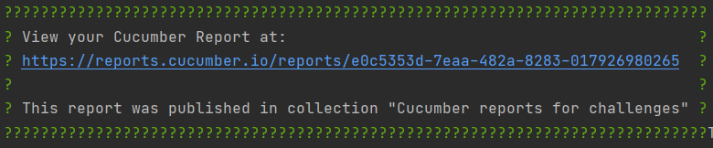

# Desafio Itaú
Contém plano de testes, relatórios de testes e automação

## Planos de teste
* Web ([WEB_TEST_PLAN.md](src/test/resources/web/WEB_TEST_PLAN.md))
* API ([API_TEST_PLAN.md](src/test/resources/api/API_TEST_PLAN.md))

### Resultados dos testes
Por utilizar a versão mais recente do Cucumber, podemos desfrutar do 
serviço do [Cucumber reports](https://reports.cucumber.io/).
Mas uma cópia deste relatório gerado pode ser encontrado em 
`src/test/resources/reports` ou acesando o [link do Cucumber reports collection](https://reports.cucumber.io/report-collections/b216cdd2-25d5-4b38-a389-36403f5f4cee).

## Pré-requisitos
* Instalar o [ChromeDriver 87.0.4280.88](https://chromedriver.storage.googleapis.com/index.html?path=87.0.4280.88/)

## Executando os testes
* Caso esteja em uma máquina Windows basta executar:
`./bin/test`.
  * Note que o link do relatório dos testes do Cucumber será exibido
    na saída do console, como na imagem a seguir.
    
* Caso esteja em outro sistema operacional:
  * Adicionar a variável de ambiente: `CUCUMBER_PUBLISH_ENABLED=true`
  * Executar: `mvn clean test`